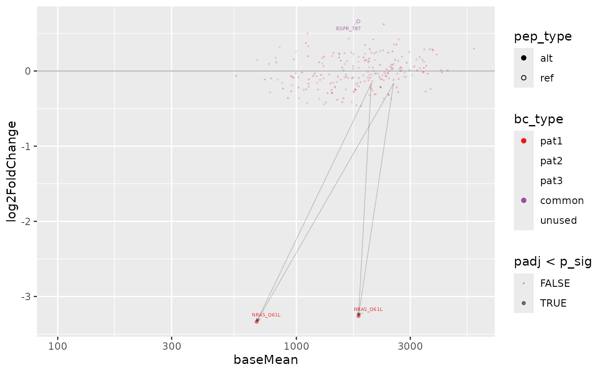

# Co-culture screen

This guide shows how to calculate differential construct abundance and
visualize the results. To calculate changes in barcode abundance, we use
the `DESeq2` package, commonly used in differential expression analysis.
Finally, we provide a utility function to visualize the results as an
MA-plot (base abundance on the x axis, log2 fold change on the y axis).

## Preparation

In order to perform this analysis, we need the `SummarizedExperiment`
(`dset`) object from the *Quality Control* results, and we need to know
which comparisons we want to perform.

From the *Quality Control* step, we know that we have two repeats each
of `Mock` and `Sample` for a patient-specific (`pat1`) and a common
library (`common`). These two repeats are important, as we need to
estimate within-condition variability as well as between-condition
variability.

However, we need to make sure to perform the screen analysis only on
relevant samples, otherwise the model may mis-estimate the variability:

``` r
dset = dset[,grepl("pat1", dset$patient)]
colData(dset)
#> DataFrame with 4 rows and 10 columns
#>           sample_id     patient       rep      origin     barcode total_reads
#>         <character>    <factor> <numeric> <character> <character>   <numeric>
#> mock1         mock1 pat1+common         1        Mock     TGAGTCC      228629
#> mock2         mock2 pat1+common         2        Mock     CAAGATG      219012
#> screen1     screen1 pat1+common         1      Sample     AACCGAC      450998
#> screen2     screen2 pat1+common         2      Sample     AGAATCG      431578
#>         mapped_reads         smp                short                  label
#>            <numeric> <character>          <character>            <character>
#> mock1         228629      Mock-1   pat1+common Mock-1 pat1+common Mock-1 (..
#> mock2         219012      Mock-2   pat1+common Mock-2 pat1+common Mock-2 (..
#> screen1       450998    Sample-1 pat1+common Sample-1 pat1+common Sample-1..
#> screen2       431578    Sample-2 pat1+common Sample-2 pat1+common Sample-2..
```

## Calculating differential abundance

When we want to perform a comparison between two conditions, we refer in
this comparison to the `origin` column of the sample sheet. In our case,
we have the origin `Mock` and `Sample`, which describe an experiment of
mock-transfected and co-cultured cells and cells transfected with the
actualy construct library, respectively.

Hence, our comparison here is that we want to see the changes of
`Sample` over the `Mock` condition, which we indicate as a character
vector of `c(sample, reference)` or a list thereof.

In case of a single comparison (character vector), a `data.frame` will
be returned. If there are more comparisons supplied in a list of
character vectors, the result will be a list of `data.frame`s:

``` r
res = screen_calc(dset, list(c("Sample", "Mock")))
#> converting counts to integer mode
#> Warning in DESeq2::DESeqDataSet(dset, ~rep + origin): some variables in design
#> formula are characters, converting to factors
#> using pre-existing size factors
#> estimating dispersions
#> gene-wise dispersion estimates
#> mean-dispersion relationship
#> final dispersion estimates
#> fitting model and testing
```

The result will look like the following:

``` r
res[[1]]
#> # A tibble: 226 × 19
#>    barcode baseMean log2FoldChange lfcSE   stat   pvalue     padj bc_type var_id
#>    <chr>      <dbl>          <dbl> <dbl>  <dbl>    <dbl>    <dbl> <fct>   <chr> 
#>  1 AACAAC…    1821.         -3.26  0.164 -19.9  2.87e-88 6.48e-86 pat1    chr1:…
#>  2 AACACC…     682.         -3.34  0.250 -13.4  1.06e-40 1.19e-38 pat1    chr1:…
#>  3 AACGGA…    1818.          0.661 0.161   4.12 3.85e- 5 2.90e- 3 common  chr7:…
#>  4 AACACA…    1114.          0.500 0.176   2.83 4.60e- 3 1.72e- 1 pat1    chr15…
#>  5 AACAGA…    1866.         -0.465 0.165  -2.82 4.76e- 3 1.72e- 1 pat1    chr9:…
#>  6 AACAAG…    2323.          0.622 0.223   2.80 5.18e- 3 1.72e- 1 pat1    chr7:…
#>  7 AACACT…    1557.         -0.413 0.149  -2.77 5.58e- 3 1.72e- 1 pat1    chr7:…
#>  8 AACACG…    1302.         -0.442 0.161  -2.74 6.10e- 3 1.72e- 1 pat1    chr4:…
#>  9 AACAGT…    1782.         -0.455 0.173  -2.64 8.36e- 3 2.10e- 1 pat1    ETV6-…
#> 10 AACAAG…    2679.          0.420 0.163   2.57 1.01e- 2 2.13e- 1 pat1    chr7:…
#> # ℹ 216 more rows
#> # ℹ 10 more variables: mut_id <chr>, pep_id <chr>, pep_type <chr>,
#> #   gene_name <chr>, gene_id <chr>, tx_id <chr>, tiled <chr>, n_tiles <dbl>,
#> #   nt <dbl>, peptide <chr>
```

## Plotting the screen results

We can plot the result of this differential abundance analysis using the
`plot_screen` function. The only argument we need supply is a results
table, but we can fine-tune the plot with the following additional
arguments:

- `sample` – which library (or libraries) to plot (default: all)
- `links` – whether to draw arrows between ref and significant alt
  peptides
- `labs` – whether to label constructs in less dense areas of the plot
- `min_reads` – a minimum read count to consider a data point for
  plotting
- `cap_fc` – a maximum (and negative minimum) fold change value for data
  points
- `p_sig` – a p-value threshold to consider a data point significant for
  labeling and linking

``` r
plot_screen(res$`Sample vs Mock`, min_reads=100)
#> Registered S3 methods overwritten by 'ggpp':
#>   method                  from   
#>   heightDetails.titleGrob ggplot2
#>   widthDetails.titleGrob  ggplot2
```



As with the *Quality Control* plots already, we can also create and
interactive plot. This will not display links between `ref` and `alt`
peptides, but instead highlight a construct group (by `mut_id`) when
interacting with a data point.
